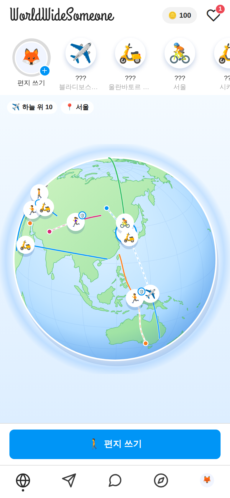
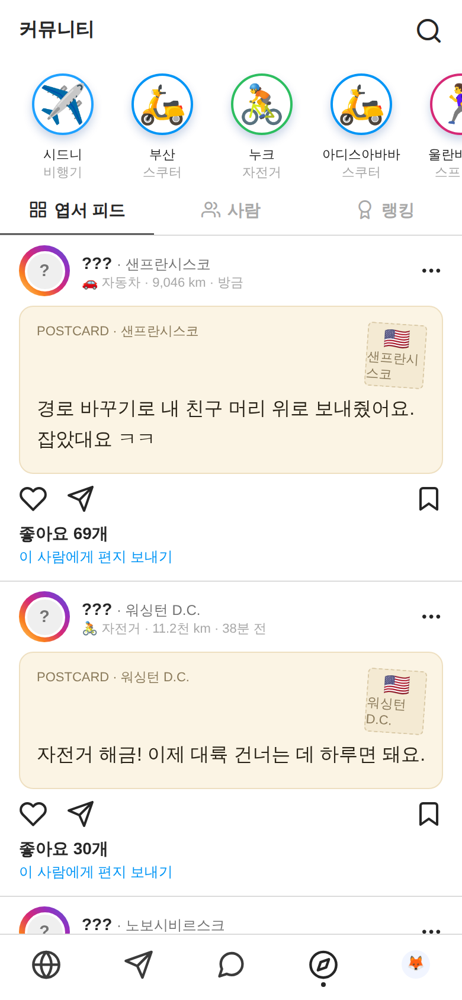
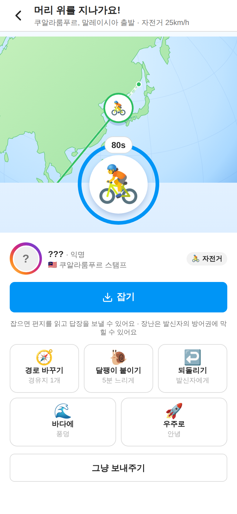
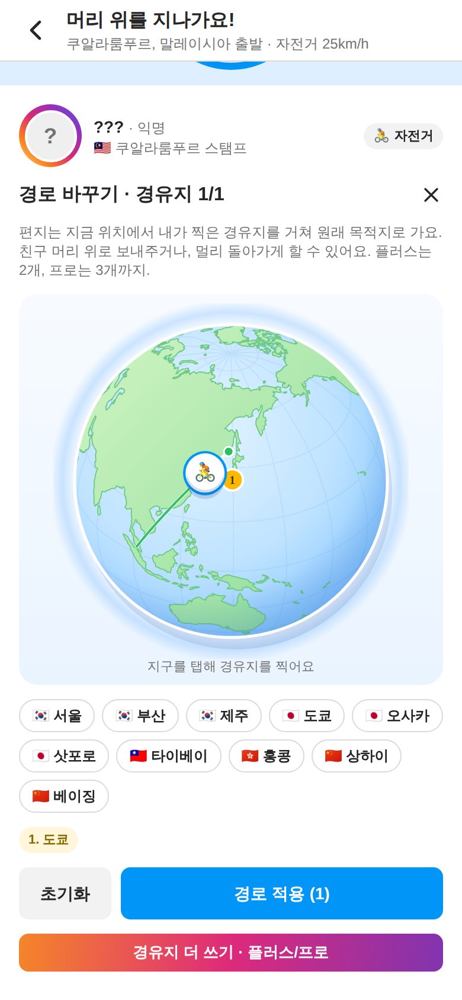

# WorldWideSomeone 🌍✈️

> 전 세계 누군가에게 편지를 날리고, 머리 위를 지나는 편지를 잡고, 답장을 승인해 실시간 친구가 되는 앱.
> **결제를 많이 하거나, 친구를 많이 만들거나** — 두 갈래로 성장하는 게임.

| 홈 (젠리 지구 + 인스타 스토리) | 커뮤니티 엽서 피드 | 머리 위 통과 → 잡기 | 경로 바꾸기 |
|---|---|---|---|
|  |  |  |  |

## 문서
- [`docs/DESIGN.md`](docs/DESIGN.md) — 하나의 흐름, 레퍼런스(인스타·젠리) 반영표, 배달원 진행(사람→로켓), 장난/방어, 요금제, 데이터 모델
- [`docs/VERIFICATION.md`](docs/VERIFICATION.md) — 단계별 · 사용자 관점 검증 리포트(자동 주행 스크린샷 증거) + 실기기/서버 체크리스트
- [`docs/LAUNCH.md`](docs/LAUNCH.md) — Firebase/GCP · EAS 빌드 · RevenueCat 결제 · 스토어 제출

## 흐름
```
쓰기 → 배달원이 들고 감(🚶 걷기 → 🏃 → 🚴 → 🏇 → 🛵 → 🚗 → 🚄 → ✈️ → 🚀, 친구 수로 해금)
   → 누군가의 머리 위 → 알림 → 잡기 | 경로 바꾸기(경유지 1·2·3) | 🐌 달팽이 | 되돌리기 | 바다 | 우주   (🛡️ 방어권이 막음)
   → 읽기 → 답장(직행) → 발신자 우편함 → 승인 → 친구 + 실시간 채팅 (승인 전엔 편지로만)
```

## 실행

### 폰에서 (Expo Go · 로컬 시뮬 모드)
```bash
npm install
npx expo start          # Expo Go 로 QR 스캔 (같은 Wi-Fi, 안 되면 --tunnel)
```
Firebase 환경변수가 없으면 봇 60명이 세계를 돌리는 **로컬 시뮬**로 전체 루프를 체험할 수 있다. 설정 → 개발자 모드에서 배속·빨리감기·편지 소환.

### 실서비스 (Firebase + dev build)
```bash
cp .env.example .env    # Firebase 웹 앱 구성값 입력
cd functions && npm install && npm run build && cd ..
firebase deploy         # rules · indexes · functions(tickWorld 스케줄러 포함)
eas build --profile development --platform android|ios
```
자세한 절차·체크리스트는 [`docs/LAUNCH.md`](docs/LAUNCH.md).

### 검증
```bash
npm run typecheck && npm run functions:build
npm run export:web && npx serve dist -l 8081 -s      # 터미널 1
BASE=http://localhost:8081 CHROMIUM_PATH=/opt/pw-browsers/chromium npm run shots && npm run report   # 터미널 2
```

## 구조
```
src/app/            expo-router 화면 (onboarding · (tabs) · compose · catch · letter · chat · user · store · settings · notifications)
src/components/     ui(인스타 키트) · globe(젠리 지구) · letter-card · vehicle-icon · profile-form · location-picker
src/engine/         geo(대권·육지 판정·격자) · sim(경로·벌칙·경로변경·통과 판정) · notify · haptics
src/store/          zustand + AsyncStorage · 게임 액션 · 로컬 봇 스케줄러
src/services/       firebase · sync(구독/콜러블) · location(GPS·백그라운드) · push · purchases(Mock/RevenueCat) · background
src/data/           vehicles(배달원) · plans(요금제·상품) · cities · bots · profile
functions/          Cloud Functions (tickWorld · sendLetter · catchLetter · redirectLetter · approveReply · likePost · onMessageCreate · revenuecatWebhook)
firestore.rules · storage.rules · firestore.indexes.json · firebase.json · eas.json · metro.config.js
scripts/            screenshots(시나리오 자동 주행) · verification-report · make-icons
```
