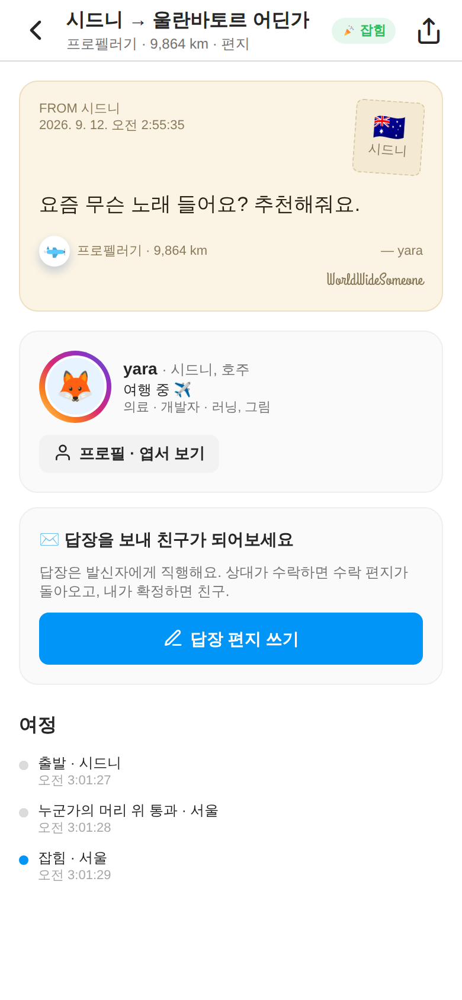
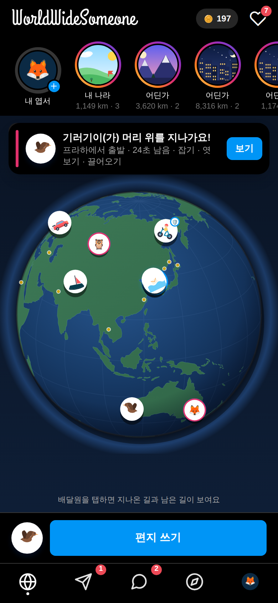

# WorldWideSomeone 🌍✈️

> 전 세계 누군가에게 편지를 날리고, 머리 위를 지나는 편지를 잡거나 엿보고 끌어오고, **내 편지에 답장이 돌아와야** 친구가 되어 실시간으로 대화하는 앱.
> **썸원코인을 쓰거나, 친구를 많이 만들거나** — 두 갈래로 성장하는 게임. 비회원으로 시작하고 보내기·좋아요 순간에만 가입.

| 홈 (젠리 지구 · 경로 숨김 · 국가 스토리) | 잡기 · 엿보기 · 끌어오기 | 받은 편지 (보낸 사람 공개 · 공유) | 다크 모드 |
|---|---|---|---|
|  |  |  |  |

## 문서
- [`docs/DESIGN.md`](docs/DESIGN.md) — 하나의 흐름, 레퍼런스(인스타·젠리) 반영표, 배달원 43종 카탈로그, 엿보기/끌어오기/바다 규칙, 요금제, 커뮤니티 프라이버시, 데이터 모델
- [`docs/ECONOMY.md`](docs/ECONOMY.md) — 썸원코인 팩·마진(≥70%)·아이템 가격·결제 유저 vs 친구 진행 타결안
- [`docs/SCALE.md`](docs/SCALE.md) — GPS 수집·통과 판정 배치·푸시 한도·실시간·트래킹 파이프라인(대규모 대비)
- [`docs/AUDIT.md`](docs/AUDIT.md) — 화면별 사용성·오류·경제/규모 상호관계 전수 점검과 결정 필요 항목
- [`CLAUDE.md`](CLAUDE.md) — 계정·키·배포 절차를 한곳에 모은 작업 지침
- [`docs/VERIFICATION.md`](docs/VERIFICATION.md) — 단계별 · 사용자 관점 검증 리포트(자동 주행 스크린샷 증거) + 실기기/서버 체크리스트
- [`docs/BROWSER-SETUP.md`](docs/BROWSER-SETUP.md) — 브라우저에서 사람이 직접 해야 하는 콘솔 작업 순서(애플·구글·카카오 로그인, Supabase, Firebase, RevenueCat, 스토어)
- [`docs/LAUNCH.md`](docs/LAUNCH.md) — Firebase/GCP · EAS 빌드 · RevenueCat 결제 · 스토어 제출

## 흐름
```
[비회원] 환영 → 위치 → 지구 + 투어 → 둘러보기·잡기·엿보기 자유 → 보내기/좋아요/댓글/채팅/결제 순간에만 SNS 가입
쓰기(해금 배달원 or SC 대여) → 배달원이 들고 감(43종 · 실시간 이동 · 도착 시간은 비공개, 속도·거리만)
   → 누군가의 머리 위 → 알림 → 잡기 | 🔍 엿보기 → 🧲 끌어오기 | 경로 바꾸기 | 🐌 | 🌊 침수(주인이 SC 로 구조) | 우주   (🛡️ 방어권이 막음)
   → 읽기(보낸 사람 프로필 · 이미지 공유) → 답장(상대 배달원 · 느리면 SC 로 가속) → 도착 → 수락 → 친구 + 실시간 채팅
   커뮤니티: 받은 편지 수·거리만 · 댓글 · 국가 스토리(탭해야 공개) · ⚡ 직행 편지(300 SC · 무조건 도착 · 환불 없음)
```

## 실행

### 폰에서 (Expo Go · 로컬 시뮬 모드)
```bash
npm install
npx expo start          # Expo Go 로 QR 스캔 (같은 Wi-Fi, 안 되면 --tunnel)
```
Firebase 환경변수가 없으면 봇 60명이 세계를 돌리는 **로컬 시뮬**로 전체 루프를 체험할 수 있다. 설정 → 개발자 모드에서 배속·빨리감기·편지 소환·답장 소환·코인.

### 실서비스 (Supabase + dev build)
```bash
npm i -g supabase && supabase login
npm run supabase:setup -- <project-ref>   # 스키마·RLS·Edge Functions·pg_cron
cp .env.example .env                       # EXPO_PUBLIC_SUPABASE_URL / ANON_KEY
eas build --profile development --platform android|ios
```
자세한 절차·체크리스트는 [`docs/LAUNCH.md`](docs/LAUNCH.md).

### 검증
```bash
npm run typecheck && npm run typecheck:functions
npm run export:web && npx serve dist -l 8081 -s      # 터미널 1
BASE=http://localhost:8081 CHROMIUM_PATH=/opt/pw-browsers/chromium npm run shots && npm run report   # 터미널 2
```

## 구조
```
src/app/            expo-router 화면 (onboarding · (tabs) · compose · catch · letter · post · chat · user · store · settings · notifications)
src/components/     ui(인스타 키트 · 라이트/다크 · 트래킹) · globe · vehicle-art(43종) · item-art · postcard-thumb · tour(투어) · signup-sheet(가입 게이트) · letter-card
src/engine/         geo(대권·육지 판정·격자) · sim(경로·궤적·벌칙·경로변경·끌어오기·침수/재부상·통과 판정) · notify · haptics
src/store/          zustand + AsyncStorage · 게임 액션(엿보기·끌어오기·수락·확정·즉시 친구·댓글) · 로컬 봇 스케줄러
src/services/       supabase · auth(SNS) · sync(구독/Edge Function 호출) · analytics(트래킹) · location(GPS·백그라운드) · push · purchases(코인 팩/플랜) · background
src/data/           vehicles(배달원) · plans(요금제·상품·한도) · cities · bots · profile
src/theme/          라이트/다크 팔레트 · ThemeProvider · useColors/useStyles
supabase/           migrations(스키마·RLS·트리거) · functions(tick-world · push-dispatch · send-letter · catch · redirect · rescue · approve-reply · boost-reply · set-location · track-events · purchase-webhook …) · tests/rls.sql
eas.json · metro.config.js
scripts/            screenshots(시나리오 자동 주행 32단계) · verification-report · setup-supabase.sh · make-icons
```
