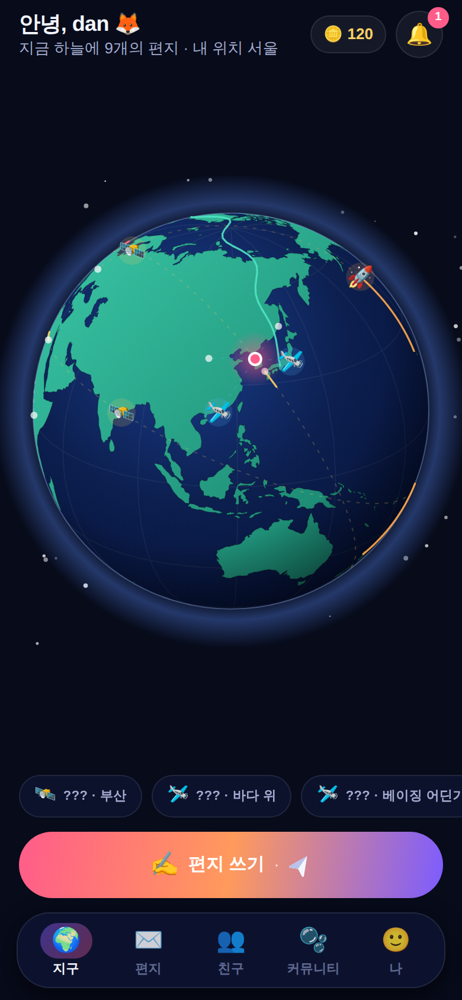
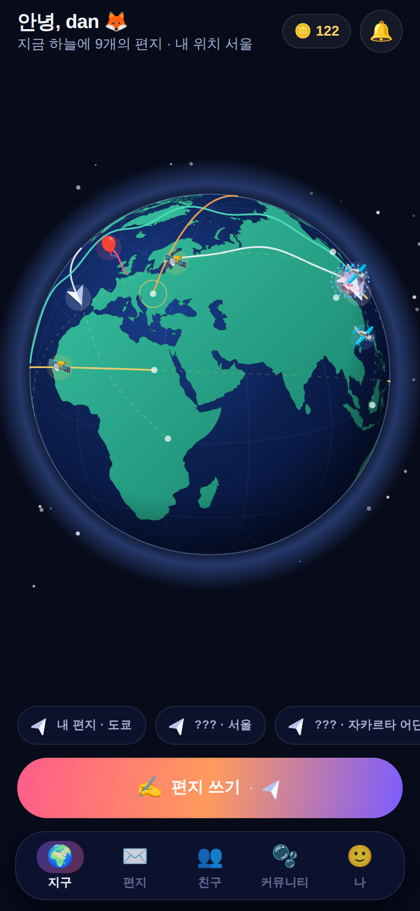
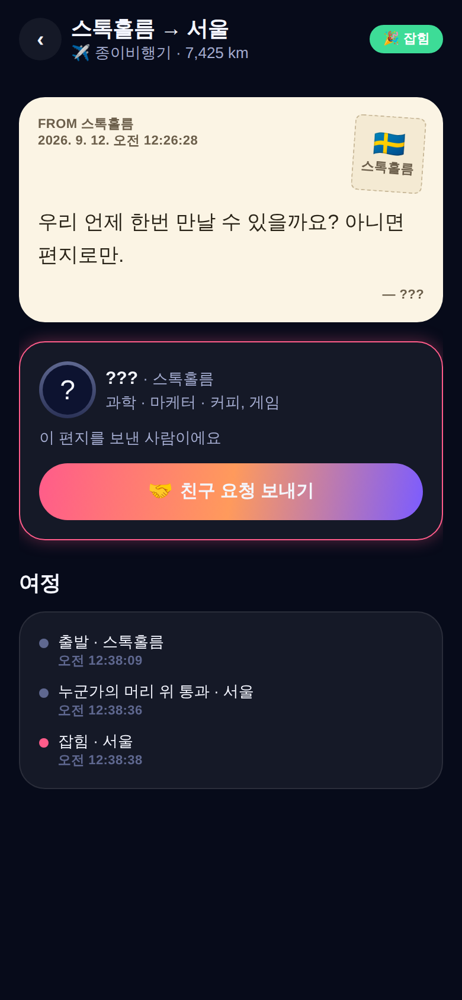

# WorldWideSomeone 🌍✈️

> 전 세계 누군가에게 편지를 날려 보내고, 내 머리 위를 지나가는 편지를 잡아 친구가 되는 앱.

| 지구 홈 | 머리 위 통과 | 잡기 | 편지 공개 |
|---|---|---|---|
|  |  |  |  |

## 핵심 루프

```
쓰기 → 날리기 → (지구를 가로질러 비행) → 누군가의 머리 위 → 알림
                                                       │
친구 ← 1:1 채팅 ← 친구 요청(즉시) ← 읽기 ← 잡기 ←───────┘
  │                                (또는 되돌리기 / 바다에 / 우주로)
  └→ 친구 수 ↑ → 운송수단 해금 (종이비행기 → 전서구 → 열기구 → 프로펠러기 → 제트기 → 로켓 → 드래곤 / 유료: UFO · 궤도 위성)
```

설계 문서: [`docs/DESIGN.md`](docs/DESIGN.md) — 레퍼런스 분석(Zenly · Instagram · Slowly · Paper Planes · Flightradar), 기능 전수조사, 화면 맵, 데이터 모델, 시뮬레이션 규칙, 요금제, 로드맵.

## 폰에서 바로 실행 (Expo Go)

```bash
npm install
npx expo start
```

1. 폰에 **Expo Go**(iOS App Store / Google Play)를 설치
2. 터미널의 QR 코드를 스캔 (같은 Wi-Fi) — 또는 `npx expo start --tunnel`
3. 온보딩에서 위치를 "내 위치"로 잡으면 실제 GPS 기준으로 편지가 출발/통과해요

> Expo Go는 최신 SDK(57)만 지원해요. 이 프로젝트는 SDK 57 기준입니다.

웹으로 보기: `npm run web` (브라우저에서 모바일 뷰포트 권장)

## MVP 범위 (서버 없음)

이 버전은 **완전 클라이언트 시뮬레이션**이에요. 전 세계 60명의 봇이 편지를 보내고, 일부는 일부러 내 상공을 지나가며, 내 편지를 잡고 친구 요청·채팅을 해요. 전체 루프의 재미를 서버 없이 검증하기 위한 구조이고, `src/engine/sim.ts`(비행 기하)는 그대로 두고 `src/store`의 봇 스케줄러만 서버 이벤트로 교체하면 됩니다.

- 시뮬 시간 배속 기본 120x (서울→도쿄 종이비행기 ≈ 2분, 지구 반대편 ≈ 15분)
- **설정 → 개발자 모드**: 배속 변경, 빨리감기, "머리 위 편지 소환", 코인 지급, 초기화

## 구조

```
src/
  app/                 expo-router 화면
    _layout.tsx        루트 Stack (온보딩 가드, 1초 게임 틱)
    onboarding.tsx     닉네임·아바타·태그·위치
    (tabs)/            지구 · 편지 · 친구 · 커뮤니티 · 나
    compose.tsx        편지 쓰기 3단계 (내용 → 목적지 → 수단·조건)
    catch/[id].tsx     잡기 (타이머 · 잡기 · 되돌리기/바다/우주)
    letter/[id].tsx    편지 읽기 · 여정 · 친구 요청
    chat/[id].tsx      1:1 채팅 (친구 전 3통 제한)
    store.tsx          상점 (방어권 · UFO · 경로 지정 · 궤도 위성 · 프리미엄)
    settings.tsx       알림·햅틱·위치·개발자 모드
  components/globe/    SVG 정사영 지구 (d3-geo + react-native-svg)
  components/ui/       버튼·카드·칩·아바타 등 디자인 시스템
  engine/              geo(대권거리·보간·육지 판정) · sim(경로·위치·통과 판정) · notify · haptics
  store/               zustand + AsyncStorage (상태 · 액션 · 봇 스케줄러)
  data/                도시 100곳 · 운송수단 · 프로필 옵션 · 봇 60명
  theme/               색 · 간격 · 타이포 토큰
docs/DESIGN.md         설계 문서
docs/screenshots/      폰 뷰포트(390×844) 자동 스크린샷
scripts/screenshots.mjs  웹 빌드를 Playwright로 돌며 전 화면 캡처 (UI 회귀 검증)
scripts/make-icons.mjs   앱 아이콘/스플래시 생성
```

## UI 검증

```bash
npx expo export --platform web && npx serve dist -l 8080 -s   # 터미널 1
CHROMIUM_PATH=/opt/pw-browsers/chromium node scripts/screenshots.mjs   # 터미널 2 → docs/screenshots/
```

## 다음 단계

1. **M1** Supabase(Realtime · Postgres · Edge Functions) 연동, Expo Push, 위치 50km 격자 스냅
2. **M2** 실결제(RevenueCat), 신고/차단, 이미지 모더레이션, 다국어
3. **M3** 도시 이벤트 편지, 스탬프 시즌, 그룹 편지
